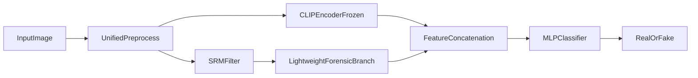

# 双流融合模型与最小对比实验

## 1. 改进目标

在不显著增加训练成本的前提下，让模型同时利用：

1. 高层视觉语义特征
2. 底层取证特征

核心假设是：语义流更适合捕捉全局结构信息，取证流更适合捕捉局部伪影和纹理异常，两者结合后，在压缩和缩放扰动下会更稳健。

## 2. 第一版改进模型

建议采用最简单、最稳妥的双流结构：

1. **语义流**：冻结 `OpenCLIP ViT-B/32`，提取图像嵌入
2. **取证流**：对输入图像做 `SRM` 残差提取，送入一个轻量 CNN 或小型 MLP 分支
3. **融合层**：将两路特征拼接后输入两层 MLP 分类头

先不要一开始做复杂交叉注意力，因为课程项目最重要的是：

1. 能跑通
2. 能比较
3. 能解释

为了让改进模型与 baseline 结果可直接比较，建议保持与现有工程一致的随机种子：`4210`。

## 3. 为什么先选 SRM 而不是更复杂方法

`SRM` 残差的优点：

1. 实现简单
2. 与数字取证任务相关性强
3. 计算成本低
4. 能自然形成与 CLIP 语义流互补的特征

如果后续时间充足，可以把 `SRM` 分支替换或补充为 `DCT` 频域分支，但这不是第一阶段必须做的内容。

## 4. 推荐结构示意

## 5. 最小对比实验

正式实验至少保留以下 3 组：

1. `Baseline`：CLIP + linear head
2. `Forensic-only`：SRM + 轻量分类器
3. `Dual-stream`：CLIP + SRM 融合模型

这三组足够回答一个关键问题：

到底是高层语义流有用、底层取证流有用，还是两者融合最有用。

## 6. 如果时间允许，再做这两个 ablation

1. 是否做偏差控制
2. 是否冻结 CLIP 主干

这两个 ablation 已经足够支撑课程项目的实验完整性，不建议再无节制扩展。

## 7. 推荐训练策略

为了控制训练成本，建议按下面顺序推进：

1. 先训 `Baseline`
2. 再单独训 `Forensic-only`
3. 最后训 `Dual-stream`

如果双流模型一开始不收敛，优先检查：

1. 两路特征维度是否对齐
2. 融合层是否过大
3. SRM 分支是否过深导致过拟合

## 8. 最终你要证明什么

双流模型至少要证明下面一件事中的一件：

1. 在标准测试集上优于 baseline
2. 在 JPEG 压缩后下降更少
3. 在小样本训练设置下仍然保持稳定优势

只要能稳定证明其中一项，这个改进就已经足够成为课程项目里的“方法贡献”。

## 9. 报告中如何讲这个模型

建议用三句话讲清楚：

1. baseline 主要依赖预训练语义特征，在扰动和小样本条件下稳定性有限
2. SRM 分支补充了底层取证信息
3. 双流融合后，模型在扰动场景和资源受限设置下更稳健

## 10. 本文档对应的执行结论

当前改进模型口径已经固定为：

1. 首选改进：`CLIP + SRM` 双流融合
2. 首选对比：`Baseline / Forensic-only / Dual-stream`
3. 首选目标：提升后处理鲁棒性和小样本下的稳定性
